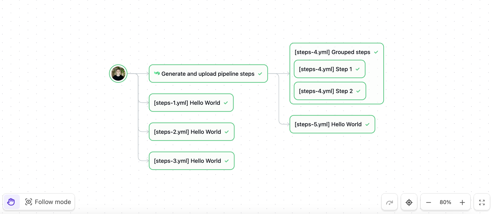
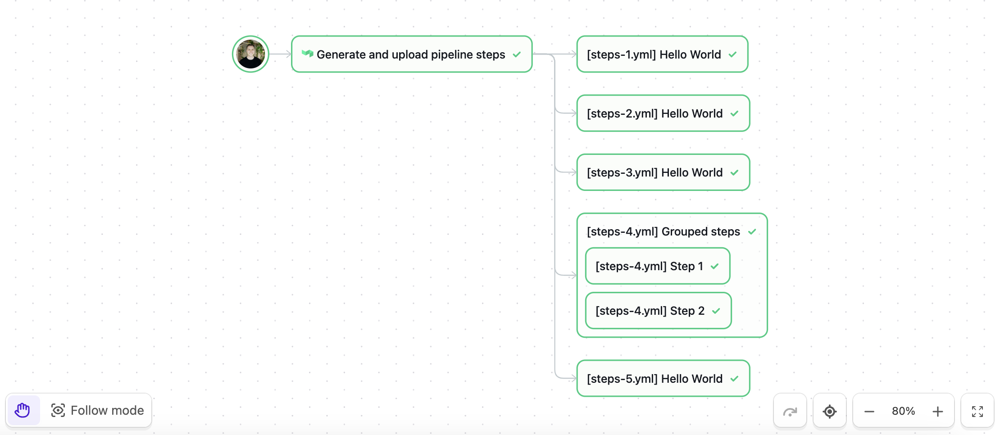

# Buildkite Implicit Dependencies

[](https://buildkite.com/new)

## Problem



We have a pipeline step `":buildkite: Generate and upload pipeline steps"` that under the hood performs multiple pipeline uploads. These steps should have an implicit dependency on the `":pipeline: Generate and upload pipeline steps"` step. However, the Buildkite UI shows some of these steps as having an implicit dependency on the root node, and some of these steps have a dependency on the `':pipeline: Generate and upload pipeline steps'` step. Why is this happening?

## Solution

What we're seeing is actually the expected behaviour given the current structure of our pipeline.

Buildkite currently has two different execution ordering mechanisms for builds:
1. **Stages mode**: This is the default mode when a build starts. In this mode, the list of jobs are grouped into stages. Every job within a stage runs concurrently but each stage runs sequentially. Stages are separated by wait or block steps, collectively called “gates”.
2. **DAG mode**: This is triggered when certain conditions are met during the build. Using `depends_on` fields, we can define arbitrary dependencies between steps.
All builds start in “non-dag mode” (or Stages mode) until any of the following conditions in the build are met:

* A `depends_on` attribute
* A `group` step
* A non-blocking `input` step

In this case, the build started in non-DAG mode. As step uploads took place, we created implicit dependencies from these steps to the root note. However, when Buildkite encountered group steps (the `"[steps-4.yml] Grouped steps"` step), the build automatically switched to DAG mode. This switch is why we saw a change in how dependencies were set and executed. And, this is also why the `"[steps-1.yml] Hello World"`, `"[steps-2.yml] Hello World"` and `"[steps-3.yml] Hello World"` steps had an implicit dependency to the root node, but the rest were downstream of `":buildkite: Generate and upload pipeline steps"` step.

Moving forward, we have a couple of options:
1. Leave it as is: Our build will continue to operate as it currently does, starting in non-DAG mode and switching to DAG mode when it encounters group steps.
2. Switch to DAG mode from the start: you can do this by changing our YAML to use a `depends_on`. Such as:

```yaml
- "label": "Generate and uplaod pipelines steps"
  "depends_on": ~ # force DAG mode
```

It’s worth noting that Buildkite plans to transition all customers to DAG-only mode in the future. This change will ensure more reproducible and consistent behaviour across all builds. We can’t just force it for all accounts just yet (as some customers rely on this existing behaviour).


